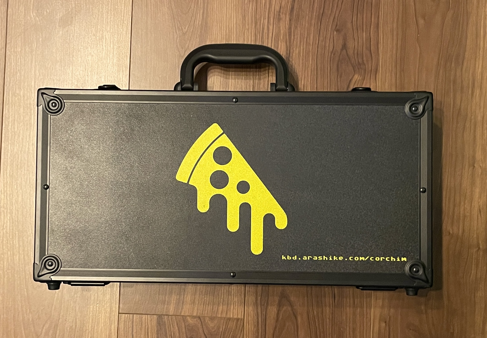
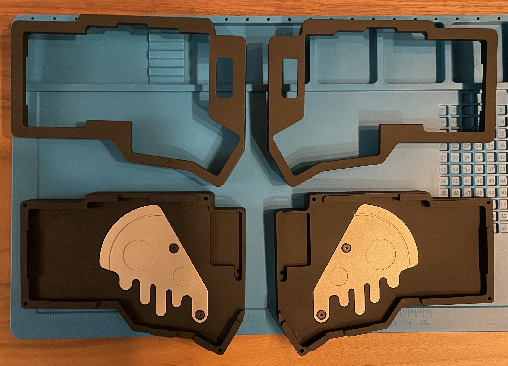
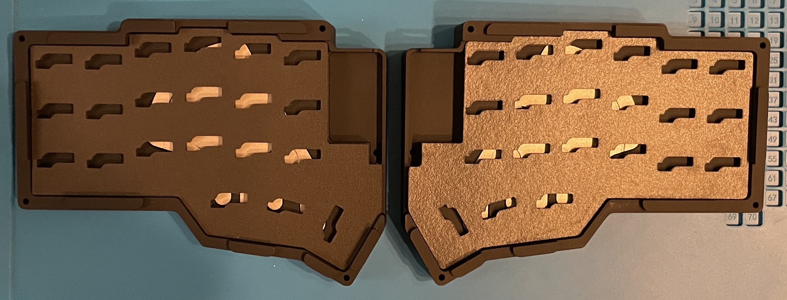
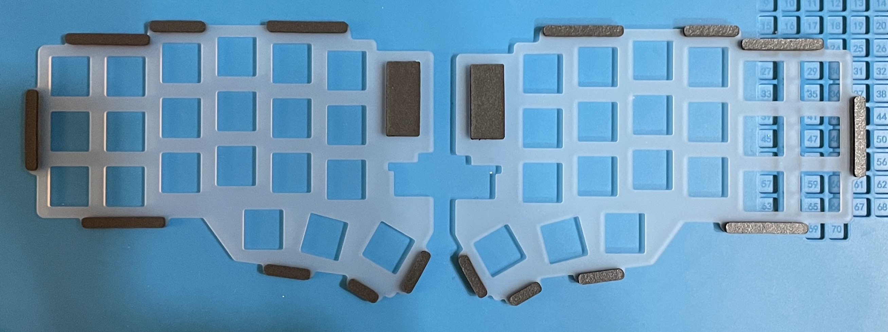
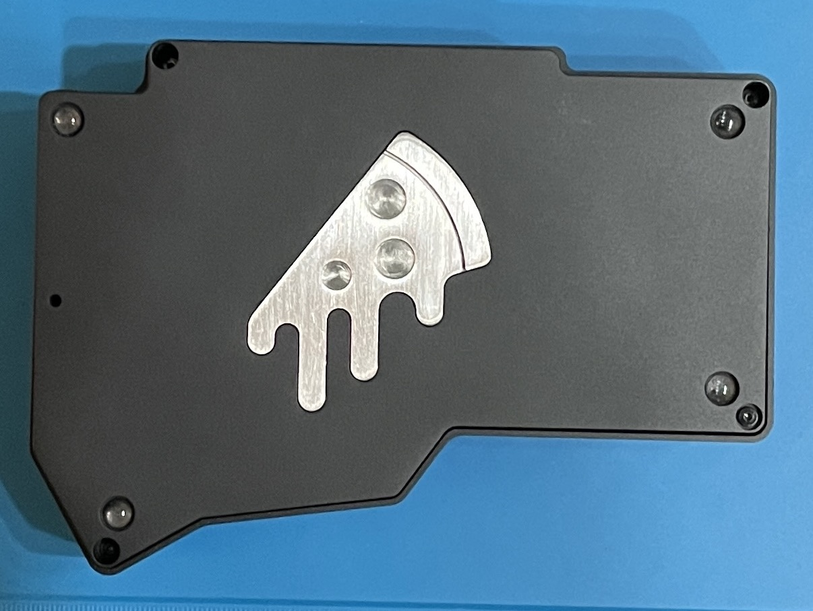
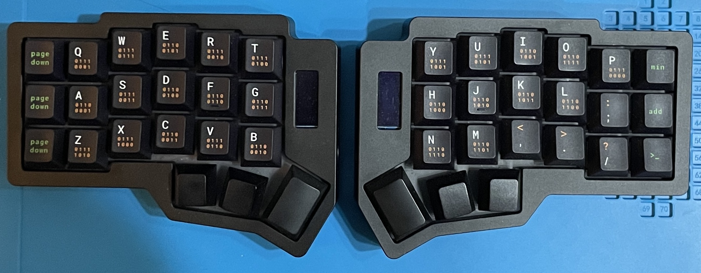

# Corchim with Corne Cherry v3

## Procedures

### 1. Check the Contents

| Name                                                        | Quantity |
| ----------------------------------------------------------- | -------- |
| Complete set for both left and right cases                  | 1 pair   |
| Case foam (to be placed between the case and the PCB)       | 2 pairs  |
| Switch foam (to be placed between the PCB and switch plate) | 1 pair   |
| Switch plate (Polycarbonate)                                | 1 pair   |
| Gasket (with adhesive)                                      | 1 pair   |
| Height adjustment foam for MCU                              | 1 pair   |
| OLED pin socket with 5.7mm height                           | 2 pieces |
| OLED pin header with 1.5mm height                           | 2 pieces |
| Rubber Feet                                                 | 8 pieces |

Only BoB, different screws is used from the factory assembly, so screws are included separately.
Space Gray uses factory assembled screws.

| Name                                                         | Quantity                             |
| ------------------------------------------------------------ | ------------------------------------ |
| Screws for securing top and bottom of the case: Hex M2 x 8mm | 8 pieces (4 each for left and right) |
| Screws for securing weight: Hexalobular M3 x 4mm             | 4 pieces (2 each for left and right) |

Each left and right case includes:

- left
  - Top body
  - Bottom body
  - Weight
  - PC plate
- right
  - Top body
  - Bottom body
  - Weight
  - PC plate

### 2. Remove the Case and Unscrew

Unscrew the temporarily fixed screws from the factory.

#### Only BoB

Replace the weight screws with the provided black M3 x 4mm screws.
Space Gray is used as is from the factory, so there is no need to unscrew the weights.

### 3. Installing the Case Foam

#### 3-a. (optional) Installing the MCU Foam

While not necessary, this mitigates the mcu shifting around when unplugging and plugging in the USB-C port.

#### 3-b. (optional) When Installing a PCB with LEDs

If you already have LEDs installed, it's a single layer of case foam, otherwise the board will feel stiff.

### 4. Installing the PCB

Place the PCB on top of the case foam, ensuring it aligns with the socket holes in the foam.

### 5. Gasket and OLED Supporting Foam

Attach the gasket to the switch plate.

At this time, also attach the OLED supporting foam to fit the OLED recess.

The gasket comes in three lengths, so attach them to fit both sides (front and back).

### 6. Setting the Switch Plate and Switch Foam

Lay the switch foam on top of the PCB as shown in the picture.

Then, lay the switch plate on top. To prevent the switch plate and switch foam from shifting when covering the case, secure the four corners with appropriate key switches.
This is also a good time to add the OLED.

### 7. Cover with Top Body and Screw Together

Cover with the top body and secure from the bottom with four M2 x 8mm screws.

### 8. Rubber Feet

Attach the rubber feet to the holes on the bottom of the case.

### 9. Keycaps

Attach the keycaps, and it's complete!! Congrats!! Enjoy your Corchim!!

