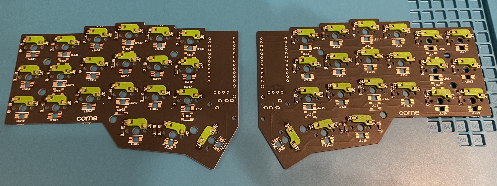
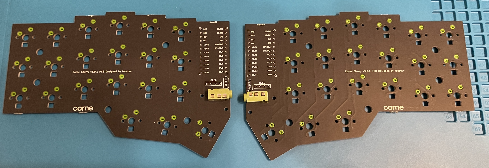
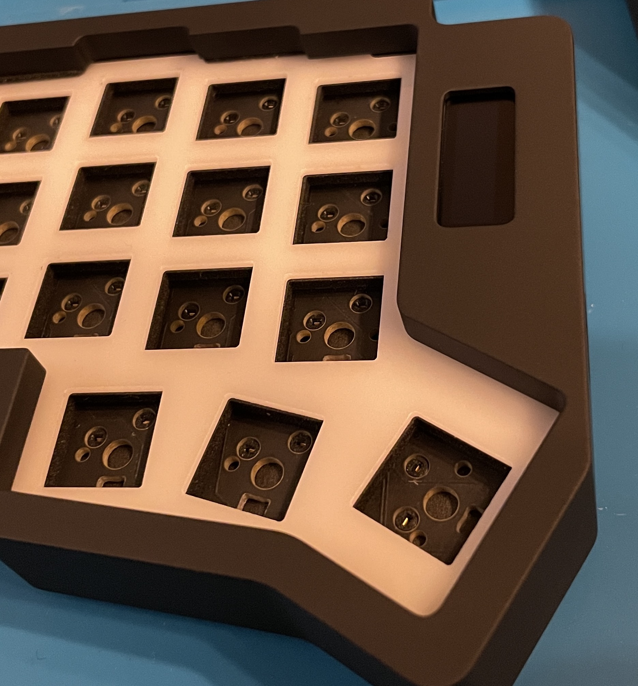
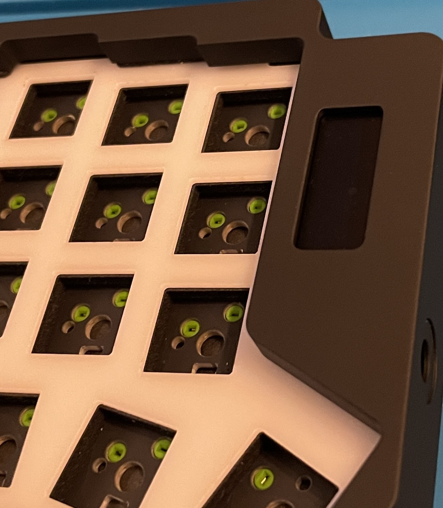
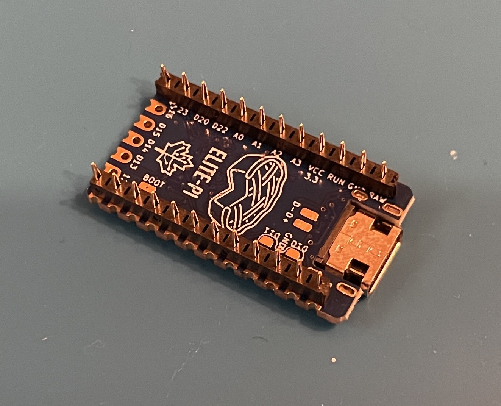

# Preparation for Corne Cherry v3 PCB

## Items Needed for PCB Assembly

| Name                                              | Quantity           |
| ------------------------------------------------- | ------------------ |
| Corne Cherry v3 PCB                               | 1 set (left and right) |
| Surface mount diodes (1N4148W)                    | 42                 |
| PCB sockets for MX                                | 42                 |
| TRRS jack (PJ-320A)                               | 2                  |
| OLED 128x32                                       | 2                  |
| Compatible MCU                                    | 2                  |
| MCU conthrough(spring pin headers) or pin socket (height 2.5mm)             | 4                  |
| Tactile switches for reset (2 pin)                | 2                  |

---

The following items are necessary but included with Corchim:

| Name                   | Quantity |
| ---------------------- | -------- |
| Pin sockets for OLED   | 2        |
| Pin headers for OLED   | 2        |

### A Note About the Color of Kailh MX Sockets

Since I was asked about this, the color doesn't matter; it's just fashion (although you might not see it with the case on). Places to purchase include:

- [Daily Craft Shop](https://shop.dailycraft.jp/products/keyswitch_socket_transparent)
- [Chosfox](https://chosfox.com/products/kailh-colorful-hot-swap-socket)
- [AliExpress](https://ja.aliexpress.com/item/1005003174680450.html)

### Compatible MCUs

- Elite-C
- Elite-Pi
- key micro
- Sea-Picro

For the key micro and Sea-Picro, we have confirmed that they operate without soldering on the MCU side. However, using Sea-Picro without soldering is not recommended due to its tendency to detach easily.

### About MCU conthrough

Due to the USB-C port, we recommend a height of 2.5mm.

## Assembly Steps

### 1. Soldering Diodes and Sockets



The soldering of [diodes](https://github.com/foostan/crkbd/blob/main/corne-cherry/doc/v3/buildguide_en.md#diodes) and [sockets](https://github.com/foostan/crkbd/blob/main/corne-cherry/doc/v3/buildguide_en.md#switch-sockets) follows the same steps as the [original Corne](https://github.com/foostan/crkbd/blob/main/corne-cherry/doc/v3/buildguide_en.md). LEDs are not supported, but having them is not a problem (more on this later).

### 2. Soldering the TRRS



The TRRS jack is also soldered following the same procedure as the original Corne.

### 3. Soldering OLED Pin Sockets


We include 5.7mm pin sockets and 1.5mm pin headers. However, the original 3.5mm pin sockets are also fine to use. Below are comparison images (there isn't much difference once the case is on).

3.5mm pin socket with 2.5mm pin header



5.7mm pin socket with 1.5mm pin header



Please cut the ends of the pin headers with clippers after soldering them to the OLED.

### 4. Reset Switch (optional)


Mounting the reset switch on the opposite side (bottom of the PCB) compared to the original Corne allows for easier access to the reset switch from the bottom of the Corchim. (However, this is optional as it can be adjusted as needed.)

### 5. Mounting the MCU

Pay attention to the direction of the MCU as it differs from the original Corne. The MCU protrudes from the bottom of the PCB, as shown in the images. If you're unsure about the mounting direction, you can check by posting a photo on our [

discord](https://discord.gg/tuykB7h5d9).




This completes the PCB assembly. Well done! Next, let's attach it to the case! [Case Assembly Guide](./corchim-cherry-v3.md)

## Firmware

I've tested with QMK version 0.23.7. I'm using crkbd/rev1, keymaps/default without any changes.

### Elite-C

```sh
$ make crkbd:default:dfu
```

Ref: [QMK Flashing Guide](https://github.com/qmk/qmk_firmware/blob/master/docs/flashing.md#make-targets)

### Elite-Pi

```sh
$ qmk flash -c -kb crkbd/rev1 -km default -e CONVERT_TO=elite_pi
```

Ref: [Keeb.io Elite-Pi Guide](https://docs.keeb.io/elite-pi-guide)

### key micro

```sh
$ make crkbd:default:dfu
```

Ref: [Abitkeys Key Micro Build Guide](https://abitkeys.com/keymicro/build.html)

### Sea-Picro

```sh
$ qmk flash -c -kb crkbd/rev1 -km default -e CONVERT_TO=promicro_rp2040
```
