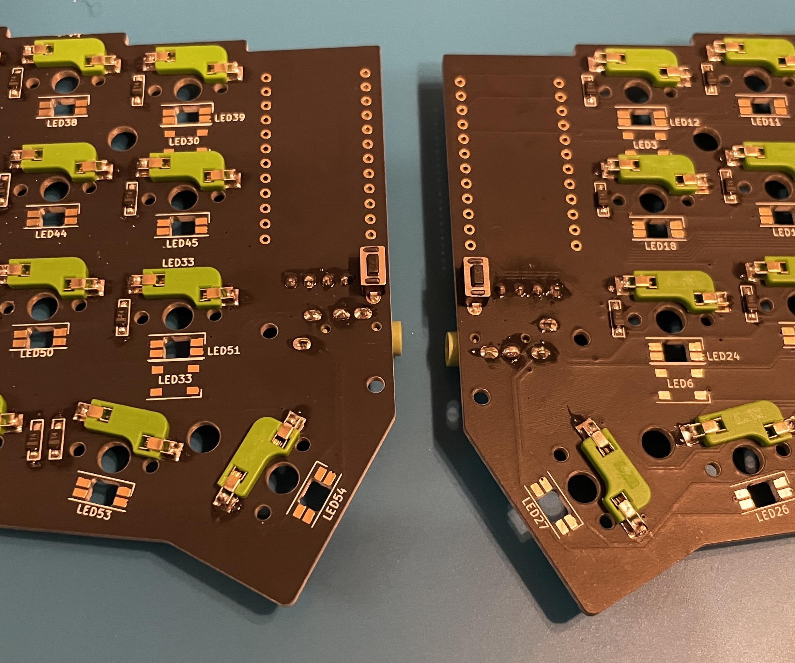
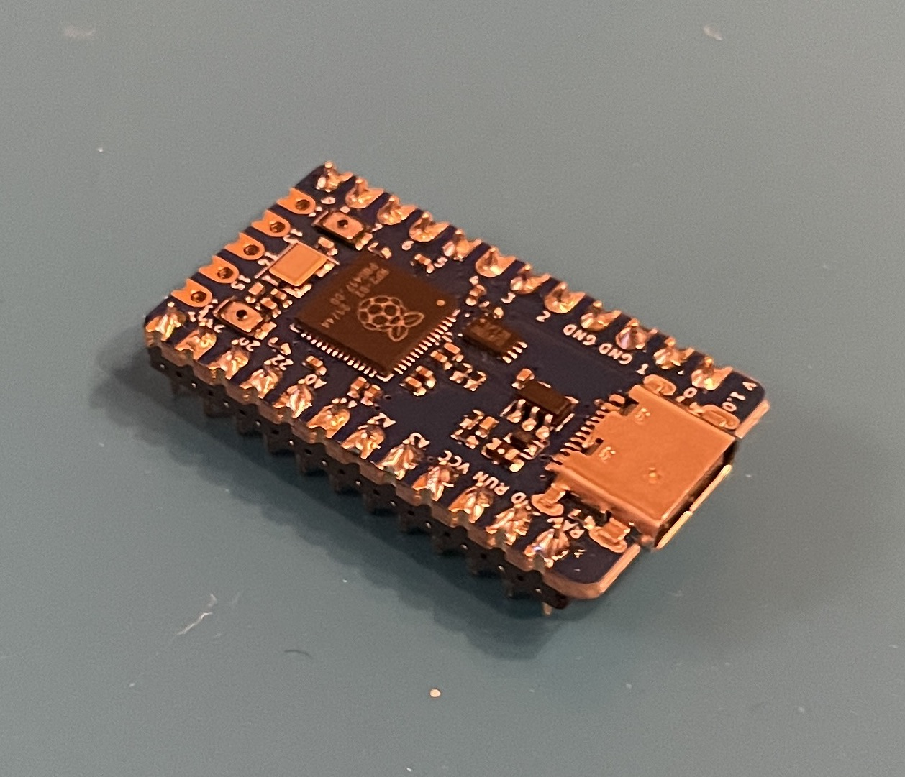
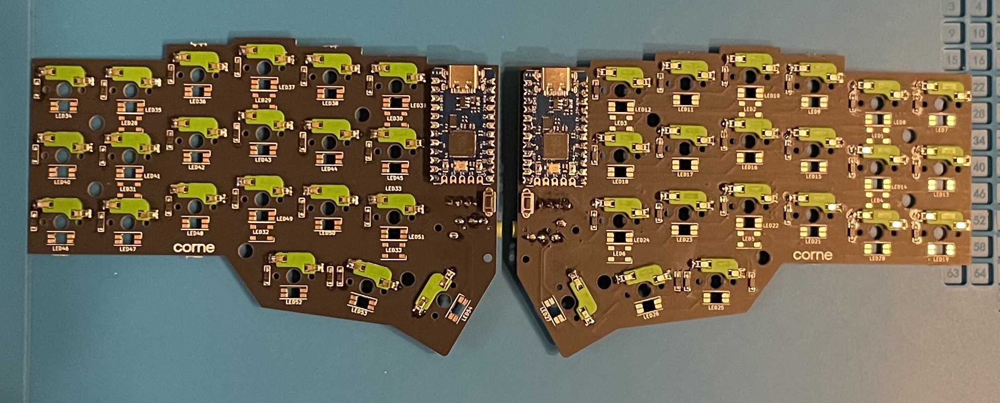

# PCB 準備 for Corne cherry v3

## PCB 組み立てに必要なもの

| 名称                                                | 個数              |
| --------------------------------------------------- | ----------------- |
| Corne cherry v3 PCB                                 | 1 セット (左右分) |
| 表面実装ダイオード ( 1N4148W )                      | 42 個             |
| MX 用 PCB ソケット                                  | 42 個             |
| TRRS ジャック ( PJ-320A )                           | 2 個              |
| OLED 128x32                                         | 2 個              |
| 対応してる MCU                                      | 2 個              |
| MCU 用コンスルーピンまたはピンソケット (高さ 2.5mm) | 4 個              |
| リセットスイッチ用タクトスイッチ (2 ピン )          | 2 個              |

---

以下は必要ですが, Corchim に同梱されています

| 名称                | 個数 |
| ------------------- | ---- |
| OLED 用ピンソケット | 2 個 |
| OLED 用ピンヘッダ   | 2 個 |

### 余談 kailh MX 用ソケットの色について

某所で質問されたので答えておくと、色はなんでも問題ありません。ファッションです ( ケースつけると見えないので特に意味はないかもですけど )。購入先としては

- https://shop.dailycraft.jp/products/keyswitch_socket_transparent
- https://chosfox.com/products/kailh-colorful-hot-swap-socket
- https://ja.aliexpress.com/item/1005003174680450.html

このあたりです。

### compatible MCU

- Elite-C
- Elite-Pi
- key micro
- Sea-Picro

上記のうち, key micro と Sea-Picro に関しては MCU 側のはんだ付けなしで動作することを確認しています。
ただし Sea-Picro をはんだなしで利用するのはかなり抜けやすいのであまりおすすめしません。

### MCU 用のピンソケット (コンスルーピン) について

USB-C の差込口の関係で, 高さ 2.5mm を推奨としいます。

## 手順

### 1. ダイオードとソケットのはんだ付け


[ダイオード](https://github.com/foostan/crkbd/blob/main/corne-cherry/doc/v3/buildguide_jp.md#%E3%83%80%E3%82%A4%E3%82%AA%E3%83%BC%E3%83%89)と[ソケット](https://github.com/foostan/crkbd/blob/main/corne-cherry/doc/v3/buildguide_jp.md#pcb%E3%82%BD%E3%82%B1%E3%83%83%E3%83%88)のはんだ付けは[オリジナルの Corne](https://github.com/foostan/crkbd/blob/main/corne-cherry/doc/v3/buildguide_jp.md)と手同じ手順です。
LED は not supported です。っが、ついていても特に問題ありません (後述します) 。

### 2. TRRS のはんだ付け


TRRS も同様にオリジナルの Corne と同じ手順です。

### 3. OLED ピンソケットのはんだ付け


5.7mm のピンソケットと 1.5mm のピンヘッダを同梱しています。
ですが、オリジナルに同梱されている 3.5mm のピンソケットであっても特に問題ないので、どちらを使っていただいても問題ありません。以下は比較画像 (ケースをかぶせるとどちらも大きく違いはありません)

3.5mm ピンソケットに 2.5mm ピンヘッダ


5.7mm ピンソケットに 1.5mm ピンヘッダ


OLED 側のピンヘッダははんだ付け後、ピンの先をニッパー等でカットしてください。

### 4. リセットスイッチ (optional)



オリジナル Corne とは反対向きに (基盤の底側に) リセットスイッチをつけることで Corchim 底側からリセットスイッチを押せるようになります。( ただこちらはなんとでもなると思うので、optional 扱いです )

### 5. MCU 取り付け

MCU の取り付け方向がオリジナルの Corne とは違うので注意です。基盤の底面から MCU が生えてくる形になるので、画像のような取付方向となります。(もし取付方向に不安が残る場合は [discord](https://discord.gg/tuykB7h5d9) に写真を貼っていただければ確認します)





ここまでで一旦 PCB は完成です, お疲れ様です!! ケースに取り付けていきましょう!! [ケース編](./corchim-cherry-v3.md)

## ファームウェア

QMK バージョン は 0.23.7 で試してます。0.23.7 における crkbd/rev1 , keymaps/default を変更無しで使用しています。

### Elite-C

```sh
$ make crkbd:default:dfu
```

ref: https://github.com/qmk/qmk_firmware/blob/master/docs/flashing.md#make-targets

### Elite-Pi

```sh
$ qmk flash -c -kb crkbd/rev1 -km default -e CONVERT_TO=elite_pi
```

ref: https://docs.keeb.io/elite-pi-guide

### key micro

```sh
$ make crkbd:default:dfu
```

ref: https://abitkeys.com/keymicro/build.html

### Sea-Picro

```sh
$ qmk flash -c -kb crkbd/rev1 -km default -e CONVERT_TO=promicro_rp2040
```
